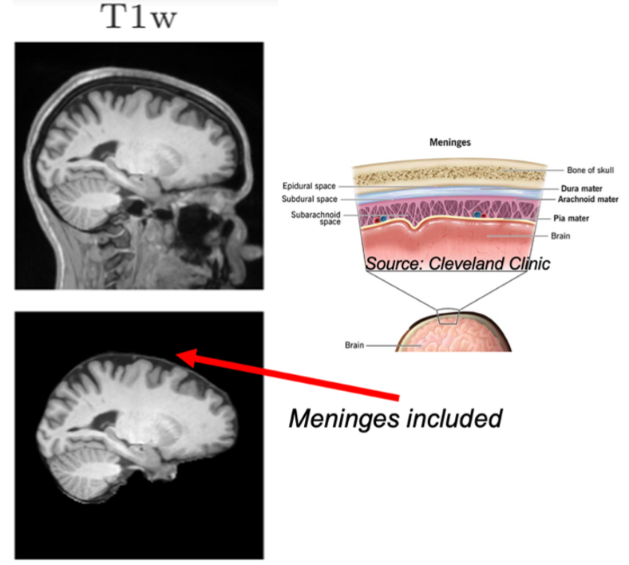
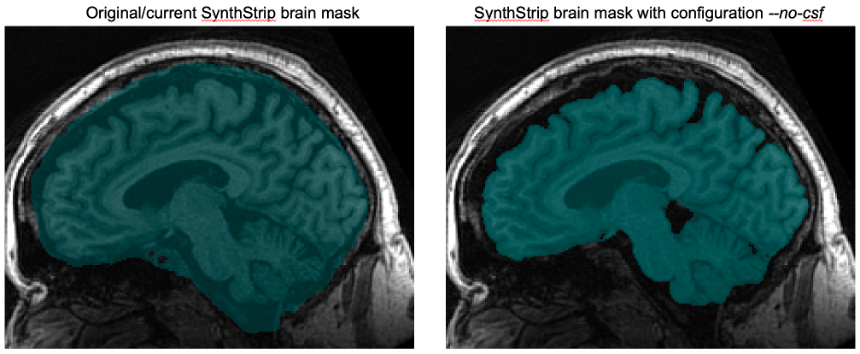
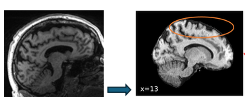
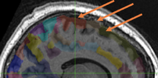

[SynthStrip](https://surfer.nmr.mgh.harvard.edu/docs/synthstrip/) is used in A2CPS Release 2.0 and later for fMRIPrep processing of fMRI, and is used in diffusion MRI products since Release 1.1. 

SynthStrip is now widely used in the neuroimaging community because it is considered "best in class" and provides very reliable and accurate skull stripping. However, its particular assumptions about what that process entails may not always match other tools, possibly introducing limited inaccuracies in normalization in certain cases.

## Problem Description

The job of SynthStrip is to remove the skull from a brain image — typically a T1-weighted (T1w) anatomy image, although the tool was designed to work on any modality. Removing the skull is a necessary part of several preprocessing steps, including mapping (normalizing) the brain to other brains, primarily brain templates.

::: {#fig-synthstrip}

SynthStrip skull stripping includes the meninges (MRI image source: SynthStrip website).

:::

There is a lingering vagueness in the imaging field about what "skull stripping" (or "brain extraction", a term sometimes, but not always, used interchangeably) precisely mean, specifically in the handling of the meninges, the layers of soft tissue between the brain and the skull (@fig-synthstrip). While the terms "skull stripping" and "brain extraction" may perhaps imply an intended handling of the meninges (i.e., "include" versus "exclude", respectively), in practice tools have not been precise enough until recently to enable distinguishing these rather similar goals, leading to an overlap in the intended meaning of the terms as they’re used by individual tools.

A result of this imprecision in terminology and processing is that volumetric normalization tools that assume "brain only" data can, when encountering "brain plus meninges", introduce a degree of mis-mapping. This is the case when supplying fMRIPrep with a mask produced from a default invocation of SynthStrip: SynthStrip produces brains with meninges included, and fMRIPrep then uses these together with templates in which meninges are not present. A T1w mis-mapping ultimately results in incorrect interpretation of other scans, e.g. fMRI, that use the anatomical scan for their own normalization.

## Details

::: {#fig-synthstrip-details}

Effect of the SynthStrip `--no-csf` option.
:::

The brain images in @fig-synthstrip showing SynthStrip’s default output on a T1w image are taken from the official SynthStrip website  and represent the default output. SynthStrip also has an optional `--no-csf` argument that attempts to exclude cerebrospinal fluid, which has the effects shown in @fig-synthstrip-details. When using this flag, SynthStrip produces a brain mask without meninges included. We are therefore testing this option for use in future A2CPS releases to mitigate mis-mapping effects. 

## Impacts

::: {#fig-synthstrip-impacts}

{width="100%"}

Default SynthStrip followed by normalization to a template brain results in gaps (where the cortex is "pushed in").

:::

This issue becomes particularly noticeable if there is cortical atrophy in a subject (thus creating an additional buffer of cerebrospinal fluid between brain and meninges). In this case, the use of the meningeal boundary as the brain boundary can lead to the cortex being "pushed in" when registered with a template (@fig-synthstrip-impacts). 

::: {#fig-synthstrip-impacts2}

{width="100%"}

Overlay of Schaefer 400 parcellation regions on normalized scan with atrophy. Arrows indicate potentially problematic inclusion of non-brain due to "gaps" left by normalization.

:::

Checks on A2CPS outputs that use the fMRIPrep pipeline have not identified any major problems. However, users should be aware of the potential for sampling issues, for example when using regions of interest in cortical areas that may be affected by atrophy (@fig-synthstrip-impacts2). 

## Other Notes

Although in principle the same issue exists in the cortical regions of diffusion MRI products due to the use of SynthStrip by QSIPrep, the practical impact in this case seems inherently limited by the typical focus on white matter in diffusion imaging (white matter normalization is not affected). 

Several morphometry measures (e.g., cortical thickness) are provided by pipelines that use different brain extraction or normalization routines and so are not affected by this issue (e.g., CAT12 calculates its brain mask differently, and FreeSurfer uses a surface-based normalization).

## Relevant References

Brain extraction remains an active area of research, and the UK Biobank recently surveyed 10 candidate tools judged compatible with its processing to compare accuracy, robustness, and processing time [Almagro et al. 2025].

[Almagro et al. 2025] 
Almagro FA, Smith S, and Lange F. Evaluation of Brain Extraction Tools on UK Biobank T1-Weighted MRI Data. Proceedings of the 31st Annual Meeting of the Organization for Human Brain Mapping (OHBM2025). Poster 1631. Brisbane, Australia, June 24-28, 2025. 
[poster abstracts book: https://zenodo.org/records/15641972]

